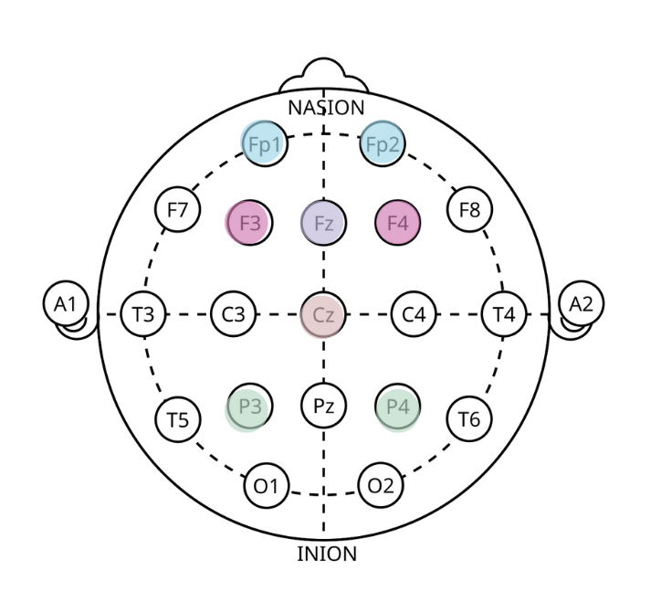
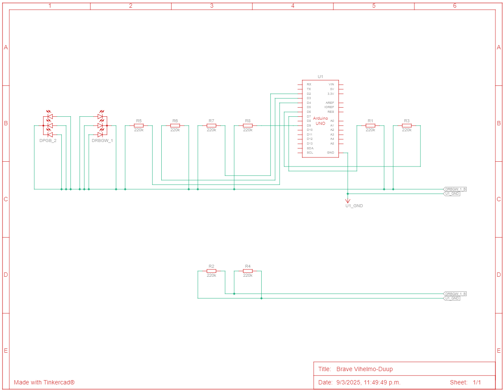

# Crux-Team-8-Emotion-Classification

## Emotion Classification using EEG for Pediatric Nonverbal Communication & Self-Regulation

Crux at UCLA - Team 8

Abril Aguilar-Lopez, Mindy Huynh, Sofia Mendoza, Navya Sahgal, Grace Saunders, Sofia Sevilla, Sydney Short, Teresa Tao

### Purpose

Develop software that can recognize 6 emotions with 75% accuracy.

Create a device that aids communication and self-regulation between those who are nonverbal or unable to express emotion with depth and providers, caretakers, friends, and family.

### Trial Procedure

#### Briefing and Setup

1.  Participant briefed on procedure 
  and reads/signs consent form.

2. EEG cap is placed & gel is 
  inserted.

3. Explain self-assessment & 
  definitions of valence and arousal.

4. Remind participant to sit still and 
  avoid speaking.

#### Data Collection

5.  Data collection starts and 
  baseline is measured for 60s.

6. Participant is showed series of 8 
  videos with 60s rest between.

7. Participant fills out self-   
  assessment during rest periods.

8. Experiment ends, equipment is cleaned up.

#### Stimulus 

Each participant will view 8 total videos in random order with one minute of rest in between.

Videos are music scenes or clips selected from popular movies designed to illicit specific emotions.

#### Self Assessment Form

Google form that each participant will fill out after each video that they watch which will help us provide feedback for supervised ML.

### Electrode Placement 

Electrodes placements (excluding GND and REF):
- Fp1
- Fp2
- F3
- F4
- Cz
- Fz
- P3
- P4

## Physical Device Design

Board Design
 

## The Valence-Arousal Emotion Model

The Valence-Arousal model is a widely used framework in emotion research. It provides a two-dimensional representation of emotions, allowing for the classification and visualization of emotional states based on their underlying psychological attributes.

**Valence:**
- Represents the pleasantness or unpleasantness of an emotion
    - Low Valence: Negative emotions such as sadness, anger, or fear.
    - High Valence: Positive emotions such as happiness, excitement, or contentment.

**Arousal:**
- Represents the intensity or activation level of an emotion
    - Low Arousal: Calm or relaxed states, such as boredom or serenity.
    - High Arousal: Energetic or activated states, such as anxiety, excitement, or elation.

